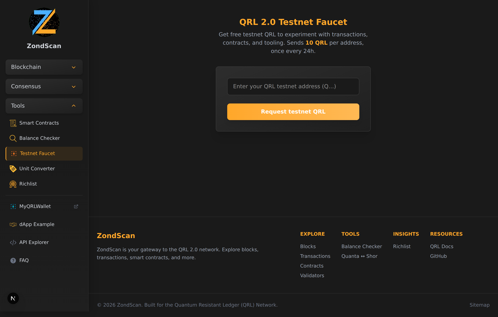

# Testnet Faucet — Screenshots & Adversarial Review

Feature branch under review: `claude/testnet-faucet-explorer-ozlsx4`
(commits `326f410`, `a8bdab5`, `2ede389`).

Files in scope:

- `ExplorerFrontend/app/faucet/page.tsx` — server component / metadata
- `ExplorerFrontend/app/faucet/faucet-client.tsx` — claim form UI
- `ExplorerFrontend/app/faucet/claim/route.ts` — GET status + POST claim handler
- `ExplorerFrontend/app/lib/faucet.ts` — config, address handling, signing/broadcast, Turnstile, cooldown
- `ExplorerFrontend/app/lib/mongodb.ts` — pooled Mongo client for the cooldown store
- `ExplorerFrontend/app/lib/helpers.ts` — `isValidQrlAddressFormat`, `formatDuration`

## Screenshots

Captured against `next dev` with `FAUCET_SEED` + `DATABASE_URL` set (so the
status endpoint reports the faucet as online and the form renders) and
Turnstile keys unset (captcha not enforced — the default dev path).

| Desktop (1440×900) | Mobile (390×844) |
| --- | --- |
|  |  |

---

## Adversarial Review

**Context that shapes severity:** this is a **testnet** faucet. Funds have no
market value, so the realistic worst cases are (a) **faucet drain** —
denial-of-service to legitimate users who can no longer claim — and (b)
**resource exhaustion** of the RPC node and MongoDB, not financial loss. The
findings below are ranked with that lens. The code is, on the whole, carefully
written and well-commented; the issues are mostly about defense-in-depth and
deployment assumptions rather than outright bugs.

### Summary

| # | Severity | Finding |
|---|----------|---------|
| 1 | High\* | Captcha is fail-open and optional; per-address cooldown is trivially bypassed by address rotation. With captcha unconfigured the faucet is openly scriptable. |
| 2 | Med–High | Per-IP cooldown is bypassable: IPv6 address rotation, and `X-Forwarded-For` / `CF-Connecting-IP` spoofing if the origin isn't locked to Cloudflare. |
| 3 | Medium | No nonce serialization — concurrent drips to different addresses collide on the faucet nonce and fail. |
| 4 | Medium | No TTL / cleanup: orphaned `PENDING` rows lock an address/IP for the full cooldown after a crash; the collection grows unbounded. |
| 5 | Medium | No global rate limit / daily cap / circuit breaker — a flood of fresh addresses can exhaust the RPC node + Mongo and drain the faucet. |
| 6 | Low | Two simultaneous first-time claims for the same key both get rejected (fails closed — safe, but a UX papercut). |
| 7 | Low | Config isn't validated: a non-numeric `FAUCET_COOLDOWN_HOURS` silently disables the cooldown. |
| 8 | Low | UX: submit isn't gated on a solved captcha; a `0x…`-prefixed address is rejected with a confusing message. |

\* "High" is relative to the faucet's own availability, not user funds.

---

### 1. Captcha is fail-open and optional; address-rotation defeats the per-address cooldown

`verifyTurnstile()` returns `true` when `TURNSTILE_SECRET` is unset, and
`getFaucetConfig().configured` only requires `FAUCET_SEED` + `DATABASE_URL` —
**not** captcha. So a deployment with a funded seed but no Turnstile keys is a
fully open, scriptable faucet whose only gate is the cooldown.

The cooldown is keyed on `(address, ip)`. The attacker fully controls `to`:
a QRL address is just `Q` + 40 random hex (`normalizeQrlAddress` enforces only
the format, not ownership or a checksum). So the per-address half of the
cooldown provides **zero** rate limiting against an attacker — every request
uses a fresh address. The entire defense therefore collapses onto the per-IP
cooldown (finding #2) and, if configured, Turnstile.

**Recommendations**
- Treat captcha as mandatory in production. When `FAUCET_SEED` is set but
  Turnstile is not, log a loud startup warning (and consider refusing to serve
  claims unless an explicit `FAUCET_ALLOW_NO_CAPTCHA=true` escape hatch is set).
- Add a **global** daily drip cap (see #5) so address rotation can't drain the
  balance even if captcha is somehow bypassed.

### 2. Per-IP cooldown is bypassable

`clientIp()` trusts, in order, `CF-Connecting-IP` → `X-Real-IP` →
first hop of `X-Forwarded-For`. Two problems:

- **Origin not locked to Cloudflare.** All three headers are client-settable. If
  the origin is reachable directly (not exclusively through Cloudflare), an
  attacker hits the origin and sets `CF-Connecting-IP: <anything>` to forge a new
  "IP" on every request — unlimited claims. The code's own comment notes XFF is
  spoofable, but `CF-Connecting-IP` is equally spoofable to a *direct* caller.
  **The origin must be firewalled to accept traffic only from Cloudflare IP
  ranges**, and that requirement should be documented next to `FAUCET_RPC_URL`
  in `.env.example`.
- **IPv6 rotation.** The full IP string is the key. A client with a single IPv6
  `/64` (routinely handed out by ISPs/clouds) has 2⁶⁴ source addresses, each
  counted separately → the per-IP cooldown is meaningless for IPv6. Group IPv6
  by `/64` (and IPv4 by `/32` or a small prefix) before keying the cooldown.

When no IP header is present at all, `claimSlot` drops IP from the `$or` and
falls back to address-only — which #1 shows is no limit at all.

### 3. Concurrent drips collide on the faucet nonce

`sendFaucetDrip()` reads `getTransactionCount(from, 'pending')` and signs with
that nonce. The cooldown prevents two *same-address* claims overlapping, but two
claims for **different** addresses (different IPs) pass the cooldown
independently and run concurrently. Both read the same pending nonce and
broadcast two txs with the same nonce and identical fees → the node rejects one
("nonce too low" / "replacement underpriced"), surfacing as `BROADCAST_FAILED`.
Throughput is effectively one drip per block, and bursts produce spurious
failures (the reservation is correctly released, so users can retry).

**Recommendation:** serialize signing+broadcast behind a per-faucet-account
mutex/queue, or manage the nonce explicitly (track and increment in-process,
reconcile from the node on error).

### 4. No TTL / orphaned `PENDING` rows; unbounded growth

`claimSlot` inserts a `PENDING` row, and the rival query intentionally counts
`PENDING` rows so an in-flight reservation blocks the cooldown — correct for the
race. But if the process dies between `claimSlot` and
`finalizeClaim`/`deletePendingClaim`, the `PENDING` row is never settled and
**locks that address *and* IP for the full `cooldownHours` window** (24h by
default). There's also no TTL index, so `faucetClaims` grows forever.

**Recommendation:** add a TTL index on `createdAt` (expiry = `cooldownHours`),
which both bounds growth and auto-clears stale reservations. Alternatively
mark `PENDING` rows with a short separate expiry and sweep them.

### 5. No global rate limit / circuit breaker

There's no Next middleware and no global throttle. Each POST (when captcha is
off, or for each fresh captcha token) does a Mongo insert + a rival lookup +
several RPC round-trips (`getGasPrice`, `getBalance`, `getTransactionCount`,
sign, broadcast). A flood of fresh addresses can therefore exhaust the RPC node
and Mongo connections and drain the faucet balance, independent of the
per-key cooldown. Captcha is currently the only thing standing between the
endpoint and a script.

**Recommendation:** add a global cap (claims-per-hour and a hard daily quanta
budget for the faucet account) plus a lightweight IP/global rate limiter in
front of the expensive path. Fail fast with `503` once the daily budget is hit.

### 6. Concurrent first-claims double-reject (fails closed — safe)

When requests A and B for the same key arrive simultaneously, both insert their
`PENDING` row, then **each finds the other** as a rival, so **both** delete
themselves and return cooldown. No double-drip occurs (the important property
holds), but the first legitimate concurrent attempt can spuriously fail and
require a retry. Acceptable, worth a comment/test so it isn't "fixed" into a
double-drip later.

### 7. Config isn't validated

`cooldownHours = Number(process.env.FAUCET_COOLDOWN_HOURS || '24')`. A malformed
value yields `NaN`; `windowStart` becomes an Invalid Date and the rival query
matches nothing → the cooldown silently turns off. Similarly a bad
`FAUCET_DRIP_QUANTA` throws inside `toPlanck` at claim time (500). Validate
these at startup and fall back to safe defaults with a warning.

### 8. Minor UX / correctness papercuts

- When captcha is enabled, the submit button isn't disabled until a token is
  present; clicking submits an empty token and round-trips to a "Captcha
  verification failed" error. Gate the button on `tokenRef`.
- `normalizeQrlAddress` intentionally rejects `0x…` (QRL uses the `Q` prefix),
  but users frequently paste `0x` addresses; the resulting error doesn't explain
  that. Consider stripping or explicitly rejecting a `0x` prefix with a clear message.
- `verifyTurnstile` is called *before* the cooldown check, so every
  cooldown-rejected request still spends a Cloudflare verify call. Minor.

---

### What's done well

- `import 'server-only'` on `faucet.ts` and `mongodb.ts` keeps the seed and
  Turnstile secret out of the client bundle; only the public site key is
  `NEXT_PUBLIC_`.
- The reserve-then-check cooldown closes the obvious TOCTOU double-spend window
  and fails closed.
- Mongo/RPC failures degrade to clean `503`/`502` responses instead of leaking
  stack traces; client-facing errors are generic while details go to
  `console.error` server-side.
- Balance is pre-checked before signing; the reservation is released on drip
  failure so users aren't wrongly stuck on cooldown.
- `FaucetError.meta` (which contains the faucet address) is never serialized to
  the client — only `err.message` is returned.

---

## Resolution — fixes applied

The following changes were made on top of the faucet branch (see the same
commit/branch as this doc):

| Finding | Fix |
|---------|-----|
| 1 — captcha fail-open / address rotation | Production now **refuses claims when no captcha is configured** (`allowNoCaptcha`, default off in prod; `FAUCET_ALLOW_NO_CAPTCHA=true` to override) and logs a one-time loud warning. Added an optional **global daily quanta cap** (`FAUCET_DAILY_CAP_QUANTA`) enforced inside the drip. |
| 2 — per-IP bypass | IPv6 is now keyed on its **`/64` prefix** (`ipCooldownKey`) so a single allocation can't rotate around the cooldown. The Cloudflare/origin-lock requirement is documented in `.env.example`. |
| 3 — nonce collisions | The read-nonce → sign → broadcast path is **serialized** through a per-process mutex (`runExclusive`). Multi-instance caveat documented in-code. |
| 4 — TTL / orphaned PENDING | Added a **TTL index** (fixed 7-day retention) to bound growth; orphaned `PENDING` reservations now stop blocking after a **2-minute** reservation timeout instead of the full cooldown. |
| 5 — global rate limit | Covered by the daily cap in #1 (a per-request rate limiter is still worth adding at the edge — noted, not implemented here). |
| 7 — config validation | `FAUCET_DRIP_QUANTA` / `FAUCET_COOLDOWN_HOURS` are validated and fall back to safe defaults on invalid input. |
| 8 — UX papercuts | Submit button is **disabled until the captcha is solved**; a `0x…`-prefixed address now gets a clear "QRL addresses start with Q" message. |

Finding 6 (concurrent first-claim double-reject) is left as-is by design — it
fails closed (no double drip); the reservation-timeout in #4 also shortens its
retry window. A per-edge rate limiter (#5) and external multi-instance nonce
coordination (#3) remain as future hardening.

> Note: this branch also bundles an unrelated UI fix — the mobile footer now
> lays its link groups out in a 2-column grid instead of one tall stacked
> column (`app/components/Footer.tsx`).
